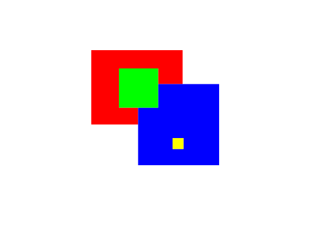

# SWF Renderer

This project provides rendering backends for an eventual Flash Player (it should be split)
in smaller parts.

The priority is to provide a renderer using the Canvas API compatible with both the browser
and Node, eventually working in a worker. (Shumway uses Buffers to send draw commands.) In
the mean time it could be interesting to investigate a standalone Rust renderer.
[OpenGL support is not a priority](https://softwareengineering.stackexchange.com/a/252600/275891),
but we definitely want to support SVG and DOM layers (text, video, ...).

For the moment it's in a **very** early stage, it can render shapes using solid fills with
the canvas API. It rendered [squares.swf](https://github.com/open-flash/swf-parser/blob/master/test/end-to-end/squares/squares.swf)
correctly in `swf-renderer.ts/out.png`.

The most interesting part so far is the shape conversion algorithm in
`swf-renderer.ts/src/lib/simple-shape/shape.ts`. It converts the space-optimized
shape representation used in SWF files to a representation more suitable for rendering.
I believe it's one of the easiest implementation to understand by reading the code (but I
may be partial since I wrote it :P). The exact algorithm should be documented...
